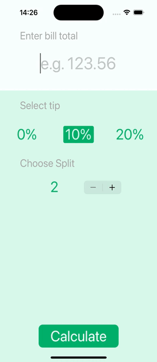

#  Tipsy Swift App

## What was do in this app

Beautiful bill splitting, tip calculating app. No one can work out $145.56 split between 5 people with a 20 percent tip. With your very own Tipsy app in hand, you’ll never need to do maths ever again!

## What was used to make this app

* The Swift Programming Language
* Storyboard
* Multi-screen app with animated navigation
* UI elements such as UILabel, UIButton, UIStackView, UIStepper

## Example what the application do

